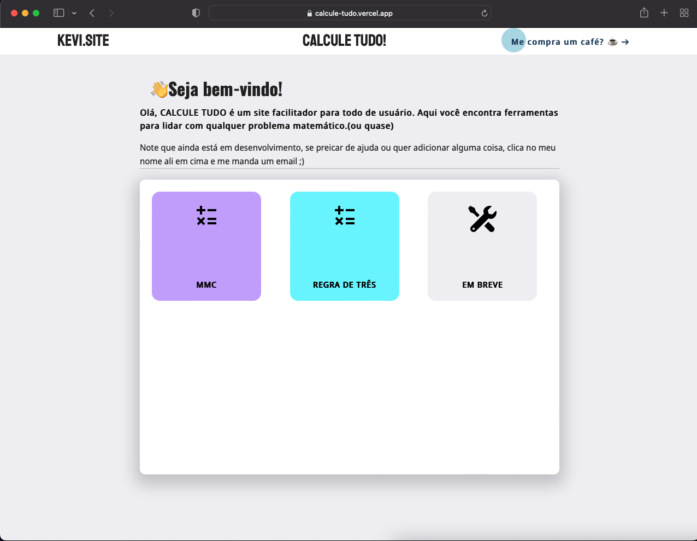
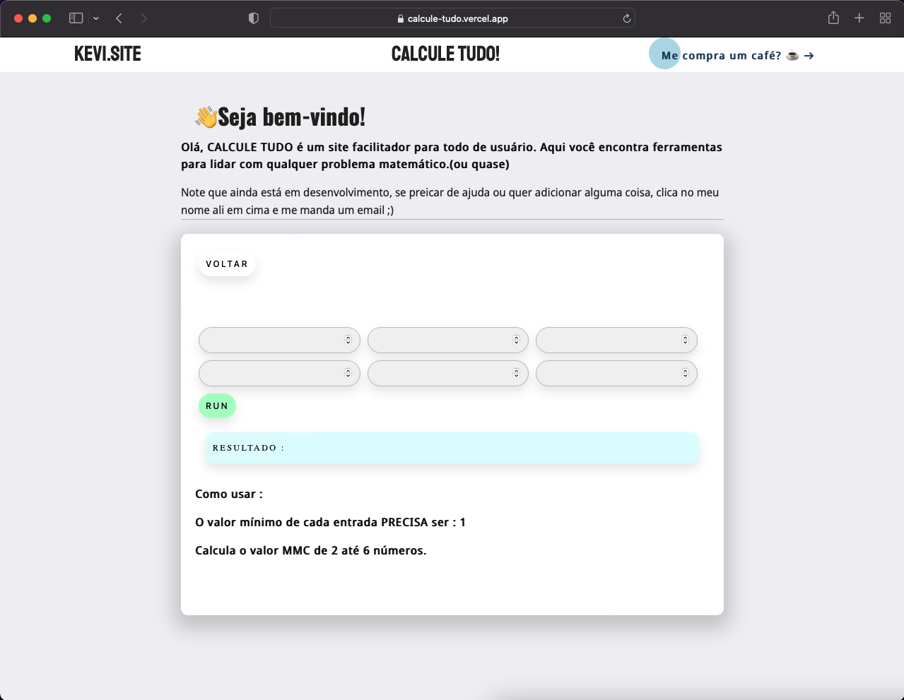
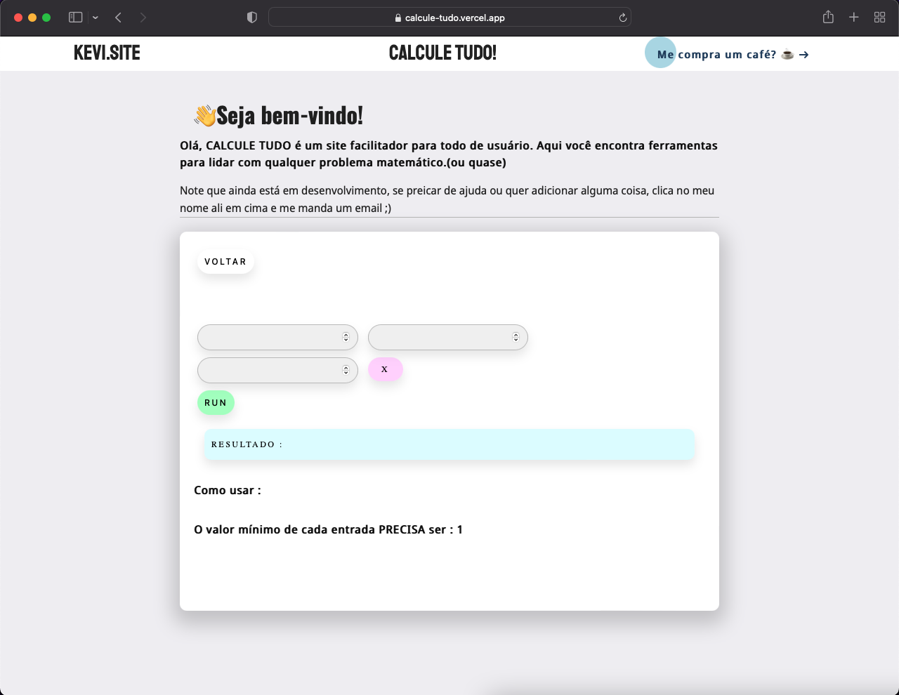

# Calcule Tudo
Aplicativo que resolve problemas matemáticos.

### Funcionalidades
<ul>
  <li> O App resolve problemas de MMC. </ li>
  <li> O App resolve problemas de Regra de três. </ li>
</ul>

### Tecnologias e ferramentas
<ul>
  <li> ReactJS </ li>
  <li> CSS </ li>
</ul>

### App
Link para o <a href="https://calcule-tudo.vercel.app/"> App </a>.
